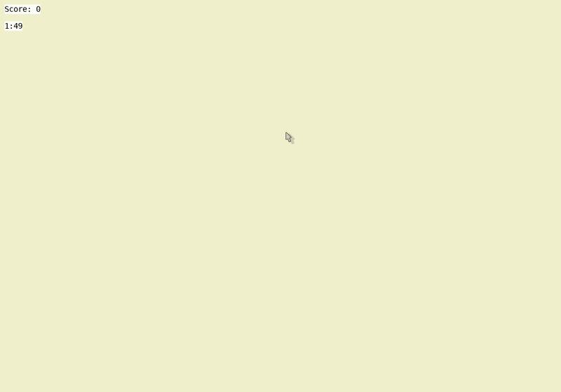

# typenoir
A noir themed spelling game. Written in python. Files included are game script, and supplementary game engine functions.

## How To Play
Sound required:
Player must spell the given word, and can hear it used in a sentence if needed.

Keyboard controls only:

- (Left Shft) plays a hint
- (Right Shft) repeats word
- (Enter) Submit word

See options menu for more detail

## Running the game
```
python game.py
```


